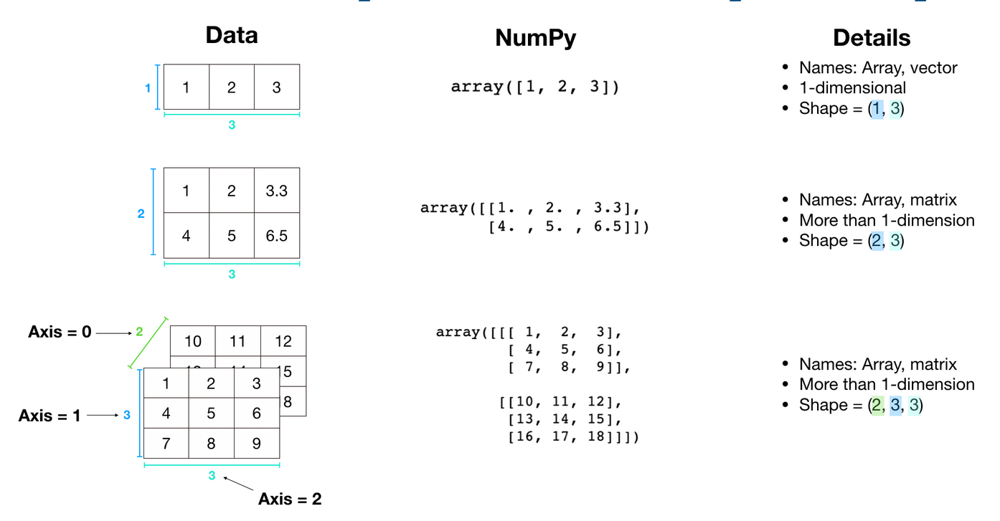

# Numpy Introduction

It stands for numerical python. It turns data into a series of numbers.

Numpy is part of the data analysis section of the ML framework.

## Why Numpy?

1- It is really fast, mainly because behind the scenes it is written in C.

2- It uses vectorization via broadcasting (avoiding loops).

3- It is the backbone of other Python scientific packages.

## Scope of this section

1- Most useful functions.
2- NumPy datatypes & attributes (ndarray).
3- Creating arrays.
4- Viewing arrays & matrices.
5- Manipulating & comparing arrays.
6- Sorting arrays.
7- Use cases.

## Anatomy of a Numpy array

